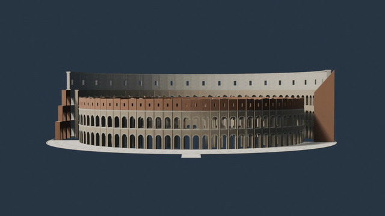

# 3d-architectures

# 使用方式

1. 去[https://www.blender.org/download/](https://www.blender.org/download/)下载blender并安装
2. 把主prompt和任务prompt拼在一起，丢给AI，当然，如果在同一个对话里，可以不用重复输入主prompt
3. 最后会生成一坨文件，找到xxx.blend文件，直接用blender打开它，就可以看效果了 

# demo




# prompts

## 主prompt

```
你将使用自己云电脑中的 Blender，完成一座全球著名建筑的外部中高精度 3D 重建。

目标是：远景和中景具有较高辨识度，主要比例、轮廓、结构与标志性细节可信，并且可以在 Blender 中进行外部视觉漫游。项目仅用于个人研究和非商业展示。

一、资料研究

1. 在开始建模前，先从建筑官方网站、博物馆或管理机构、UNESCO、Wikimedia Commons、可靠建筑资料等来源收集：
   - 正面、背面、左右侧面照片
   - 四个方向的 45 度照片
   - 航拍或屋顶照片
   - 平面图、立面图或剖面图
   - 至少一个可靠的实际尺寸
2. 建立 sources.md，记录每个参考来源、链接、用途和许可信息。
3. 不要导入、复制或修改网上现成的完整 3D 模型，也不要提取游戏或商业软件中的模型。
4. 对照片中不可见、资料互相冲突或无法确认的结构，不要自行编造；记录到 assumptions.md。
5. 明确本次重建所采用的历史时期或当前状态。

二、建模方法

1. 所有模型使用真实世界米制比例。
2. 先完成建筑白模，验证占地、总高度、层高、主要体块、轴线、对称关系和整体轮廓。
3. 白模完成后，使用与参考照片尽量一致的摄像机位置进行对照渲染。
4. 重复出现的立柱、拱窗、栏杆、屋瓦、幕墙、扶壁等结构，优先使用：
   - Array
   - Mirror
   - Geometry Nodes
   - Collection Instance
   - Blender Python
5. 影响建筑轮廓和投影的结构使用真实几何体；只有近距离不需要观察的微小纹样才使用法线、凹凸或置换贴图。
6. 禁止用大量没有经过塑形的球体、立方体和圆柱体冒充建筑雕塑或复杂装饰。
7. 为主要结构使用有意义的英文名称，并按以下 Collection 管理：
   - 00_REFERENCE
   - 01_BLOCKOUT
   - 02_STRUCTURE
   - 03_MODULES
   - 04_DETAILS
   - 05_MATERIALS
   - 06_GROUND
   - 07_LIGHTS
   - 08_CAMERAS
8. 每完成一个重要阶段保存一个新版本，不要覆盖：
   - v01_research
   - v02_blockout
   - v03_structure
   - v04_details
   - v05_materials
   - v06_final

三、复原范围

1. 只制作外部，不制作室内。
2. 制作建筑主体、必要的台基、入口、道路和少量紧邻环境。
3. 不要扩展成整座城市，也不要把时间浪费在人群、车辆或复杂植物上。
4. 不使用 Godot、Three.js 或其他游戏引擎，除非我之后明确要求。
5. 当前任务不要求游戏碰撞体，也不保证实时帧率。

四、材质与照明

1. 使用可编辑的程序化材质或来源许可清晰的 PBR 贴图。
2. 表现建筑材料的尺度、颜色变化、接缝、风化和粗糙度，但不要用过强污渍遮盖几何错误。
3. 建立以下两套灯光：
   - 中性日间灯光：方便检查结构
   - 金色时刻灯光：用于最终展示
4. 使用 Eevee 生成检查预览；资源允许时使用 Cycles 输出最终静帧。

五、质量检查

1. 至少建立正面、背面、左右侧面和四个 45 度检查摄像机。
2. 将关键参考照片与对应渲染图进行半透明叠加，检查：
   - 总体高宽比
   - 透视轮廓
   - 层高和轴线
   - 门窗位置
   - 屋顶和塔楼形状
3. 至少进行三轮“渲染—比较—修正”。
4. 检查重叠面、悬空结构、反向法线、缺失贴图和意外穿插。
5. 如果某些结构只能近似，必须在最终报告中明确说明，不要声称达到测绘或文物修复精度。

六、漫游设置

1. 创建名为 Exterior_Walk_Start 的摄像机。
2. 将其设置在建筑主要入口附近，镜头高度约为普通人的视线高度。
3. 确保初始位置不在墙体或地下。
4. 在 README_WALK.md 中写明：
   - 如何激活 Exterior_Walk_Start
   - 如何进入 Blender Walk Navigation
   - W/A/S/D、Q/E、鼠标和退出方式
   - 这是外部视觉漫游，可能穿墙，没有游戏碰撞体

七、最终交付

请交付：
- 最终 .blend
- 一份外部展示用 .glb
- 8 张检查视角 PNG
- 4 张最终高质量展示图
- 一段 15–30 秒外部环绕动画
- sources.md
- assumptions.md
- README_WALK.md
- final_report.md

工作过程中持续推进，不需要在每个小步骤等待我的批准；但完成白模后先向我发送一组预览。如果整体比例存在重大不确定性，在继续制作细节前询问我。

```

## 巴黎圣母院  

```
建筑任务：巴黎圣母院 Notre-Dame de Paris。

以 2024 年重新开放后能够可靠核实的外部状态为基准。重建范围包括西立面、双塔、中殿、耳堂、后殿、屋顶、尖塔和飞扶壁系统。

优先保证：
1. 西立面三段式构图和双塔比例；
2. 三座门廊、国王长廊和玫瑰窗的位置关系；
3. 中殿、耳堂、后殿与飞扶壁的真实结构逻辑；
4. 尖塔高度、位置和轮廓；
5. 建筑从正面、塞纳河侧和东南侧观察时均具有可靠辨识度。

门廊雕塑和滴水兽不要求逐尊精确雕刻。近景可见的主要雕塑需要制作可信轮廓；更小的雕刻使用浮雕、法线或置换表达，禁止用模糊球体冒充。

紧邻环境只保留前广场、地面和少量尺度参照物，不制作巴黎城市街区。

```

## 泰姬陵  

```
建筑任务：印度阿格拉泰姬陵 Taj Mahal。

重建主陵墓、白色大理石台基、四座宣礼塔、主入口轴线、倒影池和必要的花园几何。暂不制作清真寺、答辩厅和整个园区的完整室内。

最重要的验收标准是严格的中轴对称和比例关系。优先保证：
1. 中央洋葱穹顶与四个角亭的体量；
2. 四座宣礼塔的位置、高度和分段；
3. 主立面的巨大拱形壁龛；
4. 穹顶、檐口、角亭与立面之间的轮廓关系；
5. 从主入口沿倒影池观察时的经典构图。

大理石嵌花、书法和格栅不需要全部建成几何体。近景标志性纹样使用清晰贴图或浮雕，避免生成不可辨认的随机花纹。

最终增加清晨中性光和日落暖光两个展示版本，并确保倒影池反射不会掩盖建筑比例问题。
```

## 罗马斗兽场  

```
建筑任务：罗马斗兽场 Colosseum。

以当前保存下来的遗址状态为基准，而不是重建成古罗马时期完整无损的竞技场。只制作外部以及从外部拱洞能够直接看见的部分内环结构，不制作完整内部参观路线。

优先保证：
1. 椭圆平面和整体高宽比例；
2. 外墙各层连续拱券及柱式变化；
3. 保存较完整部分与坍塌部分的真实关系；
4. 外环、内环和支撑结构在破损区域的层次；
5. 地面高差、入口和紧邻广场。

连续拱券必须使用可编辑模块和阵列沿椭圆分布，不能手工随意排放。破损部分不要用纯随机布尔切割，应根据可靠照片建立主要断面。

材质重点表现石灰华石材的色差、接缝和风化；不要把整座建筑做成均匀灰色。
```

## 太和殿  

```
建筑任务：北京故宫太和殿及其直接相邻的三层汉白玉台基。

不要尝试一次制作整座紫禁城。本项目只包括太和殿主体、三层台基、主要台阶、栏杆、丹陛、紧邻广场和必要的尺度参照。

优先保证：
1. 面阔、进深和台基之间的比例；
2. 重檐庑殿顶的曲线、出檐和屋脊轮廓；
3. 斗拱、柱列、门窗和台基的节奏；
4. 屋脊构件和檐角走兽的主要轮廓；
5. 红墙柱、黄色琉璃瓦、彩画和汉白玉的材质区别。

斗拱应制作成可复用模块，不要用几块矩形木条简单表示。屋瓦使用阵列或 Geometry Nodes 排布；近距离应能看见合理瓦垄，但不要逐片手工建模。

最终镜头包括中轴正面、台阶下仰视、左前 45 度、右后 45 度和屋顶检查视角。
```

## 吴哥窟  

```
建筑任务：柬埔寨吴哥窟 Angkor Wat 的主入口轴线、中央神殿和直接相连的回廊体系。

不要复原整个吴哥考古公园。范围限定为能够表达经典中轴构图的堤道、入口、主要回廊、中央平台和五座塔式圣殿。

优先保证：
1. 中央五塔的梅花形布局和高低层级；
2. 长轴、平台、台阶与回廊的空间关系；
3. 高棉式塔顶的轮廓和层层收分；
4. 石质门洞、柱列和回廊节奏；
5. 从西侧堤道看向中央塔群时的经典剪影。

浮雕故事墙不要求逐幅雕刻。制作少量可信的代表性浮雕模块，其余部分使用浅浮雕或法线贴图。

材质表现砂岩的温暖色调、接缝、风化和局部苔藓，但不要把整座建筑覆盖成绿色废墟。环境只保留水面、堤道、草地和少量树木。
```

## 悉尼歌剧院  

```
建筑任务：莫斯科圣瓦西里大教堂 Saint Basil’s Cathedral。

仅重建建筑外部和红场上的紧邻地面，不制作内部礼拜空间。

优先保证：
1. 中央教堂与周围八座礼拜堂的平面组织；
2. 各塔楼、帐篷顶和洋葱形穹顶的高低关系；
3. 每个穹顶独特但可验证的颜色和纹样；
4. 红砖墙体、白色石质装饰、拱券和檐口；
5. 从红场经典正面、侧面和背面角度观察时均正确。

洋葱穹顶不能只由简单球体缩放完成，应建立带有纵向起伏、收尖和基座过渡的连续曲面。条纹、菱形和鳞片纹样使用程序材质与必要几何结合。

不要擅自增加幻想俄罗斯风格装饰。所有主要颜色和纹样应能追溯到参考照片。
```


## 圣瓦西里大教堂  

```
建筑任务：莫斯科圣瓦西里大教堂 Saint Basil’s Cathedral。

仅重建建筑外部和红场上的紧邻地面，不制作内部礼拜空间。

优先保证：
1. 中央教堂与周围八座礼拜堂的平面组织；
2. 各塔楼、帐篷顶和洋葱形穹顶的高低关系；
3. 每个穹顶独特但可验证的颜色和纹样；
4. 红砖墙体、白色石质装饰、拱券和檐口；
5. 从红场经典正面、侧面和背面角度观察时均正确。

洋葱穹顶不能只由简单球体缩放完成，应建立带有纵向起伏、收尖和基座过渡的连续曲面。条纹、菱形和鳞片纹样使用程序材质与必要几何结合。

不要擅自增加幻想俄罗斯风格装饰。所有主要颜色和纹样应能追溯到参考照片。
```


## 圣家堂

```
建筑任务：巴塞罗那圣家堂 Sagrada Família。

这是高难度项目。以任务执行当天能够核实的施工状态为基准，并在 final_report.md 中明确参考日期。只制作外部，不制作室内，也不要虚构尚未完成的最终形态。

优先保证：
1. 教堂总体平面、主塔群、耳堂和中殿体量；
2. 诞生立面与受难立面的明显差异；
3. 已建成塔楼的数量、高度、形态和顶部装饰；
4. 高迪式抛物线、双曲面和分枝结构的几何逻辑；
5. 从城市远景和两个主要立面观察时的剪影。

不要试图逐个完整雕刻所有人物和宗教场景。重点雕塑制作可识别的主要体块；大量细碎叙事雕塑使用高质量浮雕、置换或来源清晰的摄影材质表示。禁止用杂乱球体制造“看起来很复杂”的假细节。

先用极简白模完成整座建筑，再分别将诞生立面和受难立面作为独立子项目细化。任何无法从资料中确定的施工部分必须标注，而不是自动补全。
```


