# 3d-architectures

# 使用方式

1. 去[https://www.blender.org/download/](https://www.blender.org/download/)里下载blender并安装
2. 把主prompt和任务prompt拼在一起，丢给AI，当然，如果在同一个对话里，可以不用重复输入主prompt
3. 最后会生成一坨文件，找到xxx.blend文件，直接用blender打开它，就可以看效果了
4. 如果不在blender里用，要去Unity之类的地方用，可以直接拿对应的glb文件(当然，也可以自己在blender里改.blend，再导出)

注：glb和blend文件用lfs保存了，需要如下命令才能拉到真实文件

```shell
git lfs checkout
git lfs pull 
```

# 一些demo

## 世界八大奇迹

<table>
  <tr>
    <td>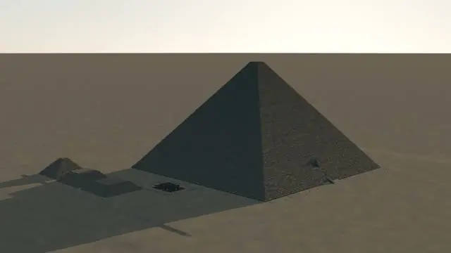</td>
    <td>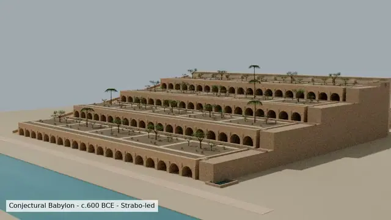</td>
    <td>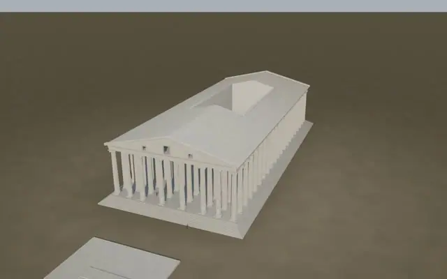</td>
    <td>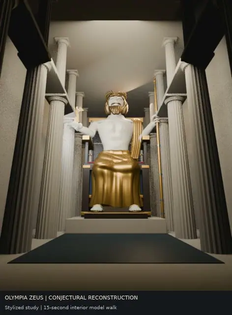</td>
  </tr>
  <tr>
    <td align="center">胡夫金字塔</td>
    <td align="center">巴比伦空中花园</td>
    <td align="center">阿尔忒弥斯神庙</td>
    <td align="center">奥林匹亚宙斯神像</td>
  </tr>
  <tr>
    <td>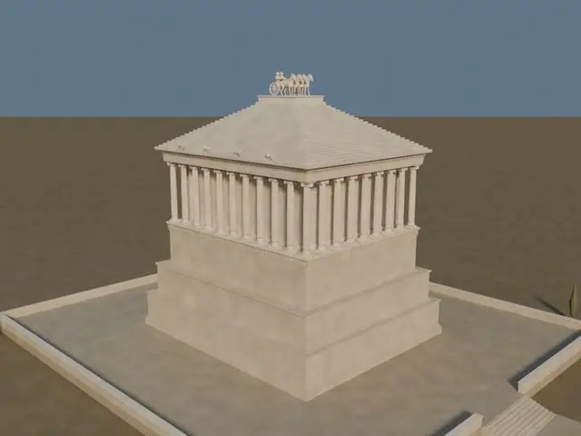</td>
    <td>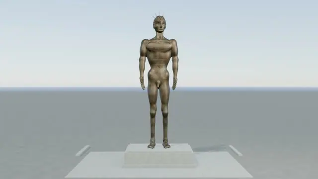</td>
    <td>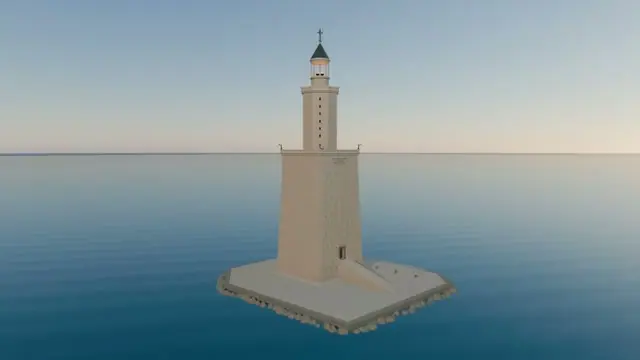</td>
    <td>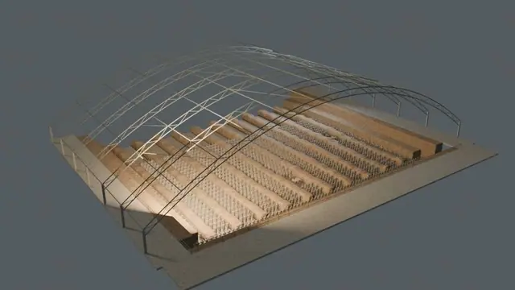</td>
  </tr>
  <tr>
    <td align="center">摩索拉斯陵墓</td>
    <td align="center">罗德岛太阳神巨像</td>
    <td align="center">亚历山大灯塔</td>
    <td align="center">秦始皇陵兵马俑</td>
  </tr>
<table>

## 国际著名建筑

<table>
  <tr>
    <td>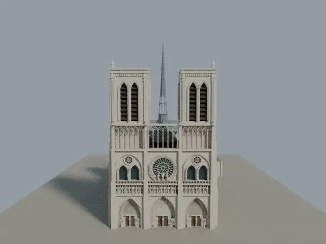</td>
    <td>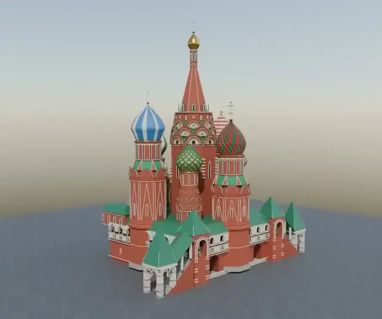</td>
    <td>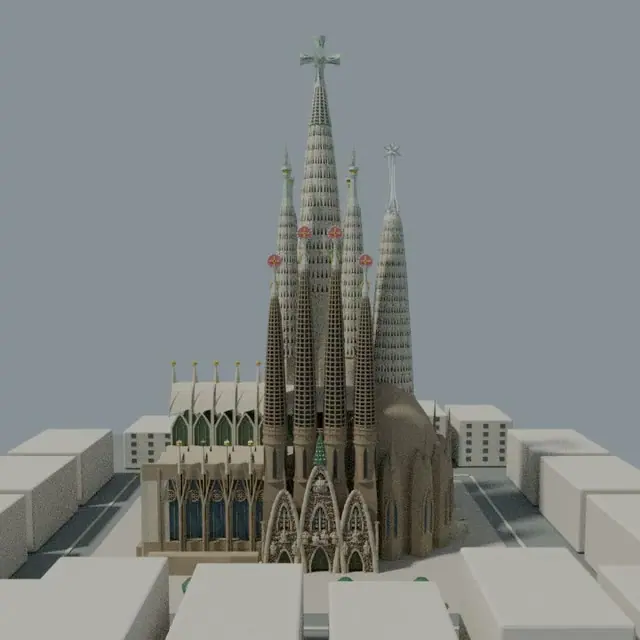</td>
    <td>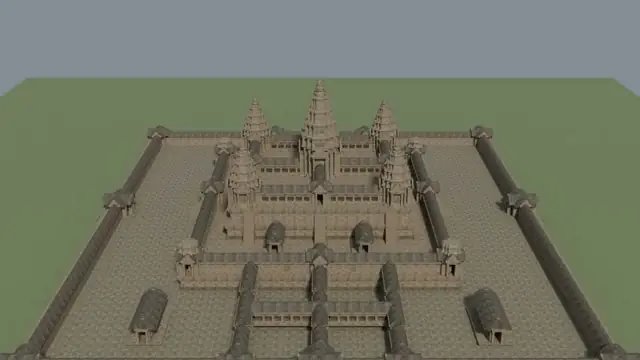</td>
  </tr>
  <tr>
    <td align="center">巴黎圣母院</td>
    <td align="center">圣瓦西里大教堂</td>
    <td align="center">圣家堂</td>
    <td align="center">吴哥窟</td>
  </tr>
  <tr>
    <td>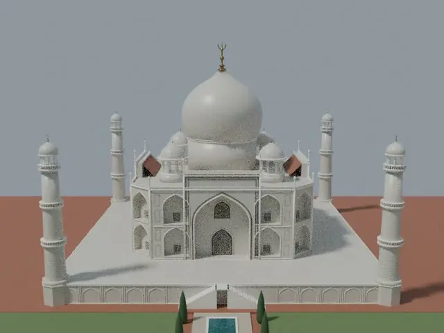</td>
    <td>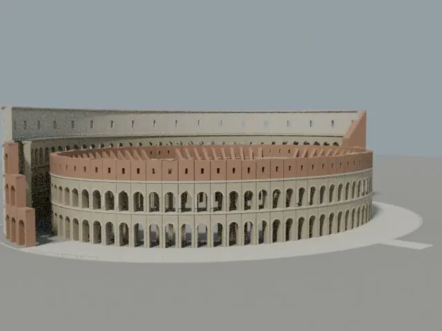</td>
    <td>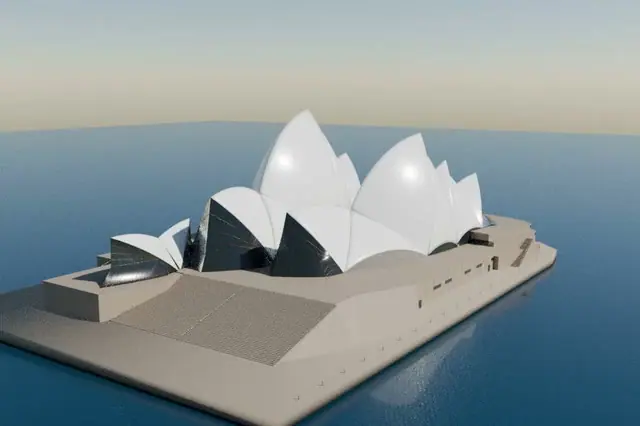</td>
    <td>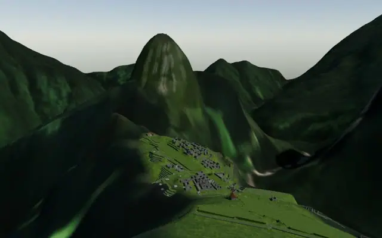</td>
  </tr>
  <tr>
    <td align="center">泰姬陵</td>
    <td align="center">罗马斗兽场</td>
    <td align="center">悉尼歌剧院</td>
    <td align="center">马丘比丘</td>
  </tr>
  <tr>
    <td>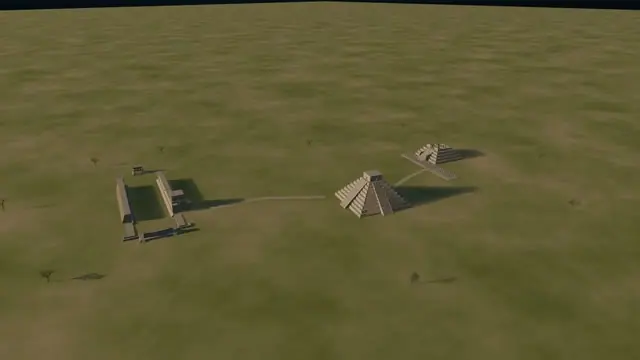</td>
    <td>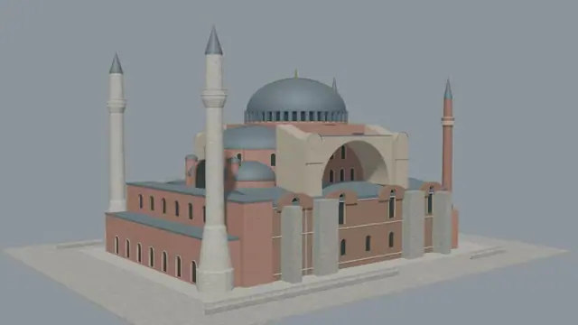</td>
    <td>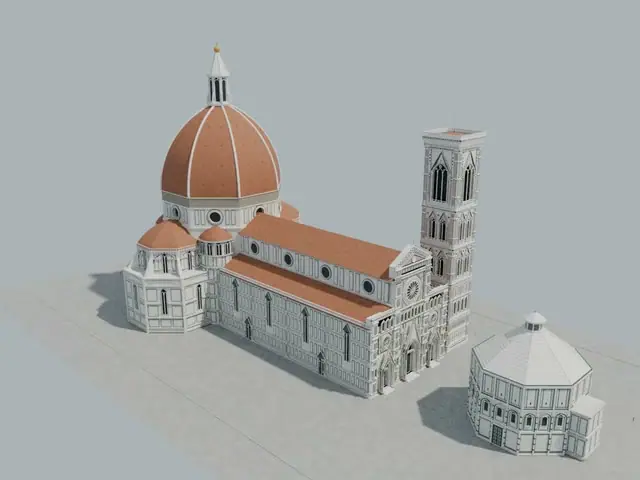</td>
    <td>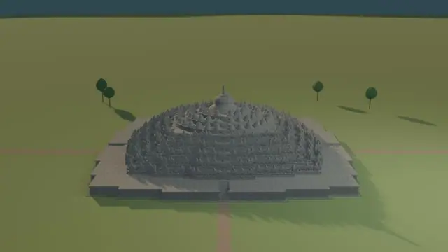</td>
  </tr>
  <tr>
    <td align="center">奇琴伊察</td>
    <td align="center">圣索菲亚大教堂</td>
    <td align="center">圣母百花大教堂</td>
    <td align="center">婆罗浮屠</td>
  </tr>
  <tr>
    <td>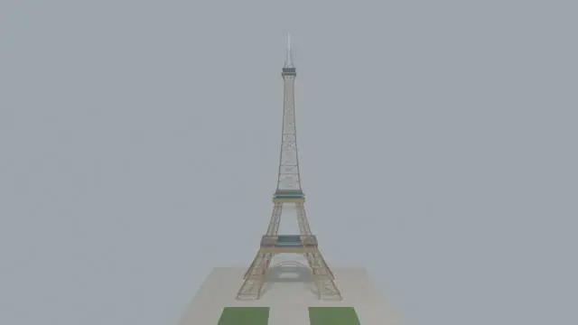</td>
    <td></td>
  </tr>
  <tr>
    <td align="center">埃菲尔铁塔</td>
    <td align="center">姬路城</td>
  </tr>

</table>

## 国内著名建筑

<table>
  <tr>
    <td>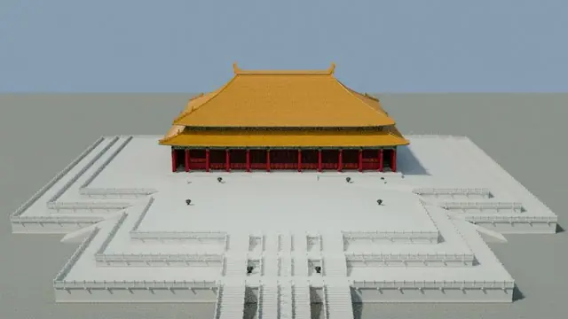</td>
    <td>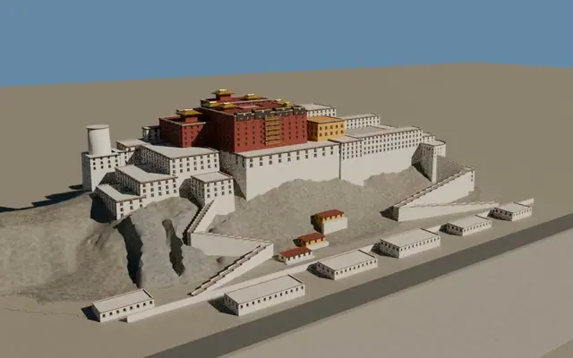</td>
    <td>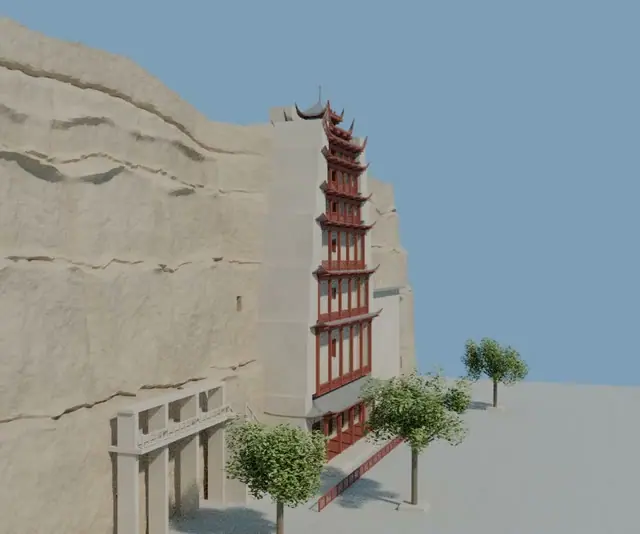</td>
    <td>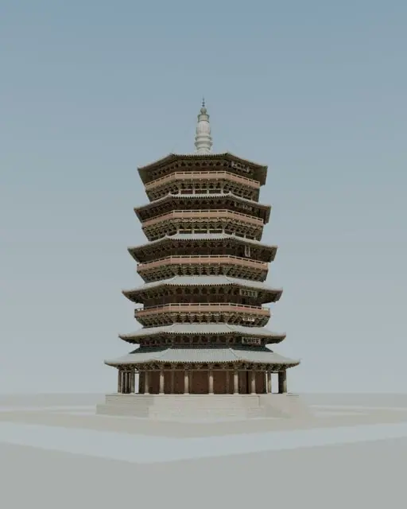</td>
  </tr>
  <tr>
    <td align="center">太和殿</td>
    <td align="center">布达拉宫</td>
    <td align="center">莫高窟</td>
    <td align="center">应县木塔</td>
  </tr>
  <tr>
    <td>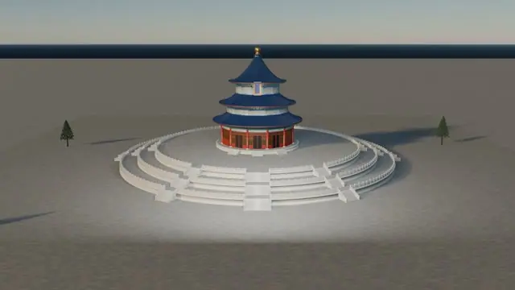</td>
    <td>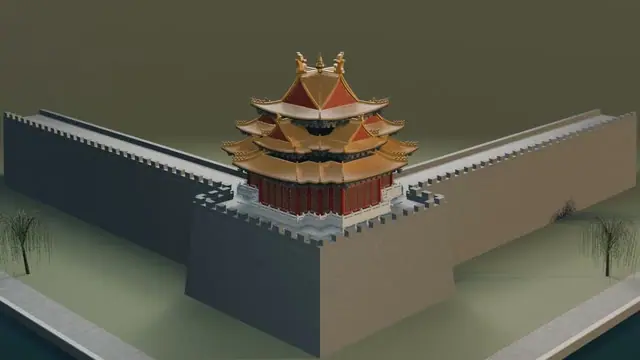</td>
    <td>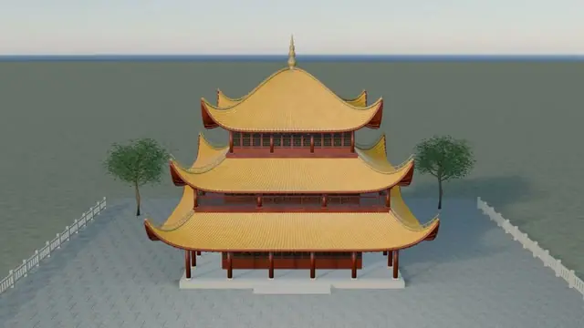</td>
    <td>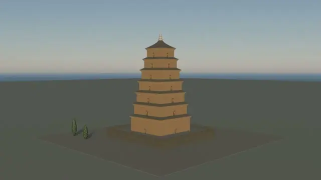</td>
  </tr>
  <tr>
    <td align="center">天坛祈年殿</td>
    <td align="center">故宫角楼</td>
    <td align="center">岳阳楼</td>
    <td align="center">大雁塔</td>
  </tr>
</table>

# 建筑类主prompts

```
你将使用自己云电脑中的 Blender，完成一座全球著名建筑的外部中高精度 3D 重建。

目标是：远景和中景具有较高辨识度，主要比例、轮廓、结构与标志性细节可信，并且可以在 Blender 中进行外部视觉漫游。项目仅用于个人研究和非商业展示。

一、资料研究

1. 在开始建模前，先从建筑官方网站、博物馆或管理机构、UNESCO、Wikimedia Commons、可靠建筑资料等来源收集：
   - 正面、背面、左右侧面照片
   - 四个方向的 45 度照片
   - 航拍或屋顶照片
   - 平面图、立面图或剖面图
   - 至少一个可靠的实际尺寸
2. 建立 sources.md，记录每个参考来源、链接、用途和许可信息。
3. 不要导入、复制或修改网上现成的完整 3D 模型，也不要提取游戏或商业软件中的模型。
4. 对照片中不可见、资料互相冲突或无法确认的结构，不要自行编造；记录到 assumptions.md。
5. 明确本次重建所采用的历史时期或当前状态。

二、建模方法

1. 所有模型使用真实世界米制比例。
2. 先完成建筑白模，验证占地、总高度、层高、主要体块、轴线、对称关系和整体轮廓。
3. 白模完成后，使用与参考照片尽量一致的摄像机位置进行对照渲染。
4. 重复出现的立柱、拱窗、栏杆、屋瓦、幕墙、扶壁等结构，优先使用：
   - Array
   - Mirror
   - Geometry Nodes
   - Collection Instance
   - Blender Python
5. 影响建筑轮廓和投影的结构使用真实几何体；只有近距离不需要观察的微小纹样才使用法线、凹凸或置换贴图。
6. 禁止用大量没有经过塑形的球体、立方体和圆柱体冒充建筑雕塑或复杂装饰。
7. 为主要结构使用有意义的英文名称，并按以下 Collection 管理：
   - 00_REFERENCE
   - 01_BLOCKOUT
   - 02_STRUCTURE
   - 03_MODULES
   - 04_DETAILS
   - 05_MATERIALS
   - 06_GROUND
   - 07_LIGHTS
   - 08_CAMERAS
8. 每完成一个重要阶段保存一个新版本，不要覆盖：
   - v01_research
   - v02_blockout
   - v03_structure
   - v04_details
   - v05_materials
   - v06_final

三、复原范围

1. 只制作外部，不制作室内。
2. 制作建筑主体、必要的台基、入口、道路和少量紧邻环境。
3. 不要扩展成整座城市，也不要把时间浪费在人群、车辆或复杂植物上。
4. 不使用 Godot、Three.js 或其他游戏引擎，除非我之后明确要求。
5. 当前任务不要求游戏碰撞体，也不保证实时帧率。

四、材质与照明

1. 使用可编辑的程序化材质或来源许可清晰的 PBR 贴图。
2. 表现建筑材料的尺度、颜色变化、接缝、风化和粗糙度，但不要用过强污渍遮盖几何错误。
3. 建立以下两套灯光：
   - 中性日间灯光：方便检查结构
   - 金色时刻灯光：用于最终展示
4. 使用 Eevee 生成检查预览；资源允许时使用 Cycles 输出最终静帧。

五、质量检查

1. 至少建立正面、背面、左右侧面和四个 45 度检查摄像机。
2. 将关键参考照片与对应渲染图进行半透明叠加，检查：
   - 总体高宽比
   - 透视轮廓
   - 层高和轴线
   - 门窗位置
   - 屋顶和塔楼形状
3. 至少进行三轮“渲染—比较—修正”。
4. 检查重叠面、悬空结构、反向法线、缺失贴图和意外穿插。
5. 如果某些结构只能近似，必须在最终报告中明确说明，不要声称达到测绘或文物修复精度。

六、漫游设置

1. 创建名为 Exterior_Walk_Start 的摄像机。
2. 将其设置在建筑主要入口附近，镜头高度约为普通人的视线高度。
3. 确保初始位置不在墙体或地下。
4. 在 README_WALK.md 中写明：
   - 如何激活 Exterior_Walk_Start
   - 如何进入 Blender Walk Navigation
   - W/A/S/D、Q/E、鼠标和退出方式
   - 这是外部视觉漫游，可能穿墙，没有游戏碰撞体

七、最终交付

请交付：
- 最终 .blend
- 一份外部展示用 .glb
- 8 张检查视角 PNG
- 4 张最终高质量展示图
- 一段 15–30 秒外部环绕动画
- sources.md
- assumptions.md
- README_WALK.md
- final_report.md

工作过程中持续推进，不需要在每个小步骤等待我的批准；但完成白模后先向我发送一组预览。如果整体比例存在重大不确定性，在继续制作细节前询问我。

```


# 世界八大奇迹

## 胡夫金字塔

```
建筑任务：埃及吉萨胡夫金字塔 Great Pyramid of Giza。

以现存遗迹、现代考古测量数据和能够可靠核实的外部状态为基准。重建范围以胡夫金字塔为主体，包括现存塔体、底部台地、少量残存覆面石、东侧神庙遗迹、附属金字塔和紧邻沙漠地面。不制作金字塔内部墓道、墓室或完整吉萨金字塔群。

优先保证：
1. 金字塔底边长度、高度、坡度、方位和真实高宽比例；
2. 四个立面、四条棱线和顶点之间的几何关系；
3. 现存阶梯状石块表面与原始平整覆面层之间的区别；
4. 金字塔基座、台地和附属遗迹的空间位置；
5. 建筑从正面、四个45度方向、近距离仰视和远距离沙漠视角观察时均具有可靠辨识度。

金字塔不能只使用一个带石头贴图的四棱锥。中远景使用分层几何和置换表现石块层级；主要近景区域制作具有真实尺度变化的石块模块。不要为整座金字塔逐块生成数百万个独立高模石块，也不要生成整齐、大小完全相同的现代砖墙效果。

紧邻环境只保留必要的吉萨台地、沙漠道路、附属遗迹和少量尺度参照物，不制作开罗城区、现代酒店、游客中心、车辆或密集游客。
```

## 巴比伦空中花园

```
建筑任务：古代巴比伦空中花园 Hanging Gardens of Babylon 历史复原。

该遗址的位置、形态甚至是否真实存在仍有学术争议。本项目必须先研究传统巴比伦复原说、尼尼微假说、古代文献描述和现有考古证据，选择一套明确的复原假说作为基准，并在 assumptions.md 中说明依据与不确定性。禁止把不同假说和影视幻想设计随意混合。

优先保证：
1. 多层台地、拱券、支撑结构和宫殿基座之间的工程关系；
2. 台地逐级上升、退让和形成空中花园轮廓的方式；
3. 灌溉水源、提升装置、水渠和各层种植区域的合理连接；
4. 泥砖、烧砖、石材、防水层与植物之间的材料层级；
5. 建筑从城市地面、宫墙附近、侧面剖视和较高俯视角度观察时均具有清晰可信的总体构图。

不要把空中花园设计成漂浮岛屿、自然山峰或巨大瀑布乐园。植物应生长在能够承重和蓄水的人工台地上。拱券、柱列和台地采用模块化结构；树木和灌木使用实例化分布，但避免覆盖全部建筑结构。水流使用水面、曲线和局部粒子表达，不进行高成本全场流体模拟。

紧邻环境只保留必要的宫墙、幼发拉底河提示、泥砖道路和少量巴比伦城市体量，不制作完整古巴比伦城，也不加入资料无法支持的幻想雕塑和巨型动物。
```

## 阿尔忒弥斯神庙

```
建筑任务：以弗所阿尔忒弥斯神庙 Temple of Artemis at Ephesus 历史复原。

以现有考古遗址、已知地基尺寸、柱础、古代文献、钱币图像和可靠学术复原资料为基准。重建范围包括神庙台基、外围爱奥尼柱廊、门廊、屋顶、山花和紧邻祭祀空间。不制作现代以弗所景区或资料不足的完整古代城市。

优先保证：
1. 巨大神庙台基、长宽比例和东西轴线；
2. 外围双重柱廊、柱距、柱高和柱列数量关系；
3. 爱奥尼柱头、柱身、柱础和檐部的建筑逻辑；
4. 门廊、内殿外部体量、山花和屋顶之间的比例；
5. 建筑从正面中轴、柱廊内部、左右45度和远距离观察时均具有可信的宏伟尺度。

柱列、柱础、柱头和檐部应使用高质量可复用模块生成，但转角柱、入口柱和可能存在的雕饰柱需要单独处理。近景可见的柱头涡卷、檐部纹样和山花轮廓使用真实几何；无法确认的雕塑不要自行补全。最终报告必须区分考古证据、古代文字描述和现代复原推测。

紧邻环境只保留神庙台地、祭坛区域、道路、少量植被和尺度参照物，不制作完整以弗所古城、现代建筑或与时代不符的希腊城市景观。
```

## 奥林匹亚宙斯神像

```
建筑任务：奥林匹亚宙斯神像 Statue of Zeus at Olympia 历史复原。

以奥林匹亚宙斯神庙考古资料、古代文献、钱币图像及可靠学术复原为基准。重建范围包括神庙内殿的必要空间、宙斯神像、宝座、基座和用于表现尺度关系的有限室内建筑结构。不制作完整神庙建筑群或奥林匹亚圣域。

优先保证：
1. 神像坐姿、总体高度和与内殿空间之间的压迫性尺度关系；
2. 头部、躯干、双臂、双腿和宝座之间的比例；
3. 右手胜利女神、左手权杖及鹰等主要构件的位置关系；
4. 黄金、象牙、木材、宝石和织物等材料层次；
5. 神像从正面中轴、左右45度、低机位仰视和神殿入口方向观察时均具有可信轮廓。

这是高风险雕塑项目。禁止使用球体、圆柱体和立方体作为最终可见的人体部件。可以使用基础体建立初始体量，但最终必须形成连续的人体和衣褶表面。面部及小型胜利女神无法达到可信质量时，应降低近景精度并明确说明，不能用粗糙几何拼装冒充完成。宝座的建筑性结构和装饰优先于无法确认的细小人物浮雕。

紧邻环境只保留神庙内殿必要的柱列、墙面、入口和地面，用于解释神像尺度；不制作完整室内陈设、祭祀活动或古代人群。
```

## 摩索拉斯陵墓

```
建筑任务：哈利卡纳苏斯摩索拉斯陵墓 Mausoleum at Halicarnassus 历史复原。

以现存遗址、博物馆保存构件、古代文献、考古测量和可靠学术复原为基准。重建范围包括高大基座、柱廊层、阶梯形屋顶、顶部四马战车雕塑及紧邻平台。不制作完整哈利卡纳苏斯古城。

优先保证：
1. 方形基座、柱廊层、金字塔形屋顶和顶部雕塑的垂直比例；
2. 四面立面、台阶、入口和柱列之间的轴线关系；
3. 爱奥尼柱廊、檐部和阶梯屋顶的结构层级；
4. 大理石墙面、浮雕带、柱构件和屋顶之间的材料区别；
5. 建筑从正面、四个45度方向、近距离仰视和远距离城市视角观察时均具有可靠辨识度。

柱列、台基层级和阶梯屋顶采用参数化模块生成。古代浮雕和人物雕塑不要求逐件精确复原；近景主要浮雕带使用可信浅浮雕，其余使用法线或置换表达。顶部四马战车是高风险有机雕塑，可优先保证整体剪影和尺度，不应使用简单马形几何体重复拼装。

紧邻环境只保留陵墓台地、台阶、低矮围墙、少量道路和植被，不制作完整港口、城市街区或资料不足的宫殿建筑。
```

## 罗德岛太阳神巨像

```
建筑任务：罗德岛太阳神巨像 Colossus of Rhodes 历史复原。

巨像的确切位置、姿态和外观仍存在重大争议。本项目必须先研究古代文献、港口考古、雕塑传统和主要学术复原方案，选择一种明确假说，并在 assumptions.md 中说明。禁止采用双腿横跨港口入口、船只从胯下穿过的流行幻想形象，除非能够提供可靠考古依据。

优先保证：
1. 巨像高度、基座尺度和与港口建筑之间的比例；
2. 站姿、重心、双腿、躯干、手臂和头部之间的结构稳定性；
3. 青铜外壳、内部支撑和石质基座的合理工程关系；
4. 日神赫利俄斯的冠饰、长袍或裸体表现所对应的明确复原假说；
5. 巨像从正面、左右45度、港口水面和远距离海上视角观察时均具有可信轮廓。

这是高风险人体雕塑项目。禁止使用球体、圆柱和方块作为最终可见人体。可以先建立低精度连续人体白模，只有在正面、侧面和45度轮廓均通过后才能制作材质。若人体质量明显不足，应停止项目并保留研究与白模结果，不要用港口、夕阳或浓雾掩盖问题。

紧邻环境只保留与所选位置假说相符的石质基座、港口岸线、少量城墙、码头和海面，不制作完整罗德城、密集船队或幻想古希腊都市。
```

## 亚历山大灯塔

```
建筑任务：亚历山大港法罗斯灯塔 Lighthouse of Alexandria 历史复原。
以法罗斯岛海底考古发现、古代文献、中世纪旅行记、钱币和马赛克图像，以及可靠学术复原为基准。重建范围包括灯塔主体、基座、入口、坡道或附属连接结构和紧邻海岸平台。不制作完整古代亚历山大港。
优先保证：
1. 下部方形塔体、中部八角塔体和上部圆形塔体的三段式比例；
2. 各层高度、收分、平台、窗洞和外部通行结构；
3. 顶部火光设施、柱廊或雕像与主体之间的关系；
4. 浅色石材、金属构件、海水侵蚀和烟火痕迹的材料区别；
5. 建筑从港口正面、左右45度、海上远景和近距离仰视角度观察时均具有可靠辨识度。
不同历史复原方案对高度、入口坡道、顶部形态和雕像存在差异。必须选择一种主要方案，不得将各方案最夸张的元素混合。塔体、窗洞、平台和石块使用模块化结构；顶部雕像无法可靠复原时，可以使用轮廓简化模型，并在报告中明确标注。
紧邻环境只保留法罗斯岛石质平台、必要防波堤、少量港口构件和海面，不制作完整亚历山大城、舰队、现代海岸或幻想宫殿。
```

## 秦始皇陵兵马俑

```
建筑任务：中国秦始皇陵兵马俑 Terracotta Army 一号坑核心区域。

以秦始皇帝陵博物院发布的考古资料、坑体测绘、军阵布局和能够可靠核实的现状为基准。重建范围限定为一号坑具有代表性的核心区，包括坑体、隔墙、过洞、铺地、陶俑军阵、陶马和用于观察遗址的有限现代保护空间。不复原未发掘区域、秦始皇陵地宫或完整博物馆。

优先保证：
1. 一号坑总体长宽、隔墙、过洞和军阵通道的空间关系；
2. 前锋、主体军阵、侧翼和后卫的排列逻辑；
3. 步兵俑、军吏俑、御手俑和陶马之间的尺度与队列关系；
4. 坑体土层、夯土地面、残损俑和修复俑的状态区别；
5. 场景从坑体端部、侧面观景区、较低军阵视角和高处俯视角度观察时均具有可靠辨识度。

这是大量人物雕塑项目，不应要求 Astra 从零逐个雕刻数千张不同面孔。先根据可靠资料制作少量具有连续人体结构的代表性陶俑基础模型，包括不同身份、服装、发髻和姿态，再通过实例化、有限变体、材质变化、缺损状态和队列规则扩展军阵。禁止使用圆柱身体和球形头部拼成军阵，也不能把所有陶俑复制成完全相同的模型。若代表性陶俑本身无法达到可信质量，应停止扩展数量。

紧邻环境只保留必要的坑体、现代保护棚结构、观景边缘和考古工作空间，不制作完整博物馆游客区、秦始皇陵地宫或未经发掘证实的地下军阵。
```

# 国际著名建筑

## 巴黎圣母院  

```
建筑任务：巴黎圣母院 Notre-Dame de Paris。

以 2024 年重新开放后能够可靠核实的外部状态为基准。重建范围包括西立面、双塔、中殿、耳堂、后殿、屋顶、尖塔和飞扶壁系统。

优先保证：
1. 西立面三段式构图和双塔比例；
2. 三座门廊、国王长廊和玫瑰窗的位置关系；
3. 中殿、耳堂、后殿与飞扶壁的真实结构逻辑；
4. 尖塔高度、位置和轮廓；
5. 建筑从正面、塞纳河侧和东南侧观察时均具有可靠辨识度。

门廊雕塑和滴水兽不要求逐尊精确雕刻。近景可见的主要雕塑需要制作可信轮廓；更小的雕刻使用浮雕、法线或置换表达，禁止用模糊球体冒充。

紧邻环境只保留前广场、地面和少量尺度参照物，不制作巴黎城市街区。

```

## 泰姬陵  

```
建筑任务：印度阿格拉泰姬陵 Taj Mahal。

重建主陵墓、白色大理石台基、四座宣礼塔、主入口轴线、倒影池和必要的花园几何。暂不制作清真寺、答辩厅和整个园区的完整室内。

最重要的验收标准是严格的中轴对称和比例关系。优先保证：
1. 中央洋葱穹顶与四个角亭的体量；
2. 四座宣礼塔的位置、高度和分段；
3. 主立面的巨大拱形壁龛；
4. 穹顶、檐口、角亭与立面之间的轮廓关系；
5. 从主入口沿倒影池观察时的经典构图。

大理石嵌花、书法和格栅不需要全部建成几何体。近景标志性纹样使用清晰贴图或浮雕，避免生成不可辨认的随机花纹。

最终增加清晨中性光和日落暖光两个展示版本，并确保倒影池反射不会掩盖建筑比例问题。
```

## 罗马斗兽场  

```
建筑任务：罗马斗兽场 Colosseum。

以当前保存下来的遗址状态为基准，而不是重建成古罗马时期完整无损的竞技场。只制作外部以及从外部拱洞能够直接看见的部分内环结构，不制作完整内部参观路线。

优先保证：
1. 椭圆平面和整体高宽比例；
2. 外墙各层连续拱券及柱式变化；
3. 保存较完整部分与坍塌部分的真实关系；
4. 外环、内环和支撑结构在破损区域的层次；
5. 地面高差、入口和紧邻广场。

连续拱券必须使用可编辑模块和阵列沿椭圆分布，不能手工随意排放。破损部分不要用纯随机布尔切割，应根据可靠照片建立主要断面。

材质重点表现石灰华石材的色差、接缝和风化；不要把整座建筑做成均匀灰色。
```


## 吴哥窟  

```
建筑任务：柬埔寨吴哥窟 Angkor Wat 的主入口轴线、中央神殿和直接相连的回廊体系。

不要复原整个吴哥考古公园。范围限定为能够表达经典中轴构图的堤道、入口、主要回廊、中央平台和五座塔式圣殿。

优先保证：
1. 中央五塔的梅花形布局和高低层级；
2. 长轴、平台、台阶与回廊的空间关系；
3. 高棉式塔顶的轮廓和层层收分；
4. 石质门洞、柱列和回廊节奏；
5. 从西侧堤道看向中央塔群时的经典剪影。

浮雕故事墙不要求逐幅雕刻。制作少量可信的代表性浮雕模块，其余部分使用浅浮雕或法线贴图。

材质表现砂岩的温暖色调、接缝、风化和局部苔藓，但不要把整座建筑覆盖成绿色废墟。环境只保留水面、堤道、草地和少量树木。
```

## 悉尼歌剧院  

```
建筑任务：澳大利亚悉尼歌剧院 Sydney Opera House。

重建范围包括平台基座、主要壳体建筑群、外部台阶、玻璃幕墙和紧邻海滨地面。不要制作音乐厅内部。

本项目最重要的是壳体几何精度，不要把屋顶简单处理成几个任意弯曲的白色三角形。

优先保证：
1. 各组壳体之间的位置、高度和朝向；
2. 壳体统一的球面几何逻辑；
3. 平台、台阶和玻璃幕墙的比例；
4. 建筑从海港、正面台阶和侧后方观察时的轮廓；
5. 白色陶瓷瓦片的尺度和反光特性。

先建立低分辨率壳体白模，对照航拍和侧面照片修正；确认壳体布局后再增加瓦片材质。瓦片优先通过程序材质或法线表达，不要逐片生成导致模型失控。

制作白天、阴天和日落三种环境预览。
```


## 圣瓦西里大教堂  

```
建筑任务：莫斯科圣瓦西里大教堂 Saint Basil’s Cathedral。

仅重建建筑外部和红场上的紧邻地面，不制作内部礼拜空间。

优先保证：
1. 中央教堂与周围八座礼拜堂的平面组织；
2. 各塔楼、帐篷顶和洋葱形穹顶的高低关系；
3. 每个穹顶独特但可验证的颜色和纹样；
4. 红砖墙体、白色石质装饰、拱券和檐口；
5. 从红场经典正面、侧面和背面角度观察时均正确。

洋葱穹顶不能只由简单球体缩放完成，应建立带有纵向起伏、收尖和基座过渡的连续曲面。条纹、菱形和鳞片纹样使用程序材质与必要几何结合。

不要擅自增加幻想俄罗斯风格装饰。所有主要颜色和纹样应能追溯到参考照片。
```


## 圣家堂

```
建筑任务：巴塞罗那圣家堂 Sagrada Família。

这是高难度项目。以任务执行当天能够核实的施工状态为基准，并在 final_report.md 中明确参考日期。只制作外部，不制作室内，也不要虚构尚未完成的最终形态。

优先保证：
1. 教堂总体平面、主塔群、耳堂和中殿体量；
2. 诞生立面与受难立面的明显差异；
3. 已建成塔楼的数量、高度、形态和顶部装饰；
4. 高迪式抛物线、双曲面和分枝结构的几何逻辑；
5. 从城市远景和两个主要立面观察时的剪影。

不要试图逐个完整雕刻所有人物和宗教场景。重点雕塑制作可识别的主要体块；大量细碎叙事雕塑使用高质量浮雕、置换或来源清晰的摄影材质表示。禁止用杂乱球体制造“看起来很复杂”的假细节。

先用极简白模完成整座建筑，再分别将诞生立面和受难立面作为独立子项目细化。任何无法从资料中确定的施工部分必须标注，而不是自动补全。
```

## 马丘比丘

```
项目：秘鲁马丘比丘 Machu Picchu 核心遗址与山地景观。

这是建筑与自然地形结合项目。范围包括核心梯田、主要石砌建筑群、中央广场、太阳神庙等外部可见结构，以及作为背景的瓦纳比丘山。不要制作完整登山路线。

优先使用可靠DEM、遗址平面图、航拍和政府或UNESCO资料。

重点保证：
1. 遗址在山脊上的总体布局；
2. 农业梯田与自然坡面的关系；
3. 主要建筑群、广场和路径的空间组织；
4. 不规则石砌墙体及门窗的典型轮廓；
5. 经典观景台视角中遗址与瓦纳比丘的比例。

不得把所有石块制作成相同砖块。建立若干石墙模块，结合局部变化和法线贴图表现砌筑方式。

云雾只能作为气氛，不能遮盖错误地形。最终同时提供晴朗检查版和晨雾展示版。
```

## 奇琴伊察

```
建筑任务：墨西哥奇琴伊察 Chichén Itzá 核心建筑群。

以现存并能够通过可靠资料核实的考古遗址外部状态为基准。重建范围包括库库尔坎金字塔 El Castillo、大球场、武士神庙、千柱群的代表性区域，以及连接这些建筑的必要地面。不制作整个奇琴伊察遗址或任何臆想恢复的完整古城。

优先保证：
1. 库库尔坎金字塔九层台基、四面阶梯和顶部神庙的比例；
2. 金字塔严格的方位、轴线、坡度和逐层收分关系；
3. 大球场墙体、比赛区域、神庙平台和石环的位置关系；
4. 武士神庙、柱廊和千柱群的排列节奏；
5. 遗址从库库尔坎金字塔正面、四个45度方向、大球场和较高俯视角度观察时均具有可靠辨识度。

台阶、台基层级、柱列和重复石构件应使用阵列、镜像或程序化模块生成，但不能把不同建筑统一处理成相同石块。羽蛇神、武士、豹、骷髅和其他石雕不要求逐件高精度雕刻；近景可见的主要浮雕需要具有可信轮廓，更小的纹样使用浮雕、法线或置换表达。不得根据影视或游戏中的玛雅幻想建筑补全已经消失的上部结构。

紧邻环境只保留低矮草地、土路、少量热带树木和遗址之间的开放空间，不制作完整尤卡坦丛林、现代游客设施或考古遗址以外的幻想城市。
```

## 圣索菲亚大教堂

```
建筑任务：土耳其伊斯坦布尔圣索菲亚大教堂 Hagia Sophia。

以现存并能够通过可靠资料核实的外部状态为基准。重建范围包括中央主体、主穹顶、东西半穹顶、侧部体量、扶壁、四座宣礼塔、入口和紧邻平台。不制作室内穹顶、马赛克、礼拜空间或完整苏丹艾哈迈德城区。

优先保证：
1. 中央主穹顶、半穹顶、附属穹顶和下部主体之间的层级关系；
2. 四座宣礼塔的位置、高度、直径、分段和顶部轮廓；
3. 拜占庭主体、后期扶壁和奥斯曼增建部分之间的体量区别；
4. 红褐色墙体、浅色石材、铅灰色屋面和金属构件的材料差异；
5. 建筑从西侧入口、东侧后殿、南北侧和城市远景观察时均具有可靠辨识度。

主穹顶不能使用独立半球直接放在方形建筑上，应表现鼓座、窗洞、拱券和半穹顶形成的逐级传力关系。重复窗洞、扶壁和屋面使用模块化构件，但不同历史阶段的墙体不能全部处理成相同表面。宣礼塔应分别依据其位置和形态校准，不能简单复制四座完全相同的圆柱塔。

紧邻环境只保留建筑平台、入口道路、少量庭院地面、围护和树木，不制作蓝色清真寺、托普卡帕宫、完整城市天际线或密集游客。
```

## 圣母百花大教堂

```
建筑任务：意大利佛罗伦萨圣母百花大教堂 Florence Cathedral。
以现存并能够通过可靠资料核实的外部状态为基准。重建范围包括主教座堂主体、布鲁内莱斯基穹顶、八角鼓座、立面、耳堂、后殿、乔托钟楼和圣若望洗礼堂。不制作教堂内部、地下遗迹或完整佛罗伦萨城市街区。
优先保证：
1. 主教座堂拉丁十字平面、长轴、耳堂和后殿之间的体量关系；
2. 八角鼓座、双层穹顶、八条主肋和顶部采光亭的比例与轮廓；
3. 西立面、侧立面、乔托钟楼和洗礼堂之间的位置关系；
4. 白色、绿色和粉红色大理石装饰形成的几何分区；
5. 建筑从西侧广场、钟楼方向、东南侧、较高俯视和城市远景观察时均具有可靠辨识度。
穹顶不能使用普通半球或简单拉伸球体代替，应根据八角鼓座、尖拱曲率、主肋和顶部采光亭建立真实连续结构。大理石立面的复杂纹样优先使用分区网格、清晰贴图、法线和局部浮雕结合表达；近景可见的门窗、壁柱、尖拱和玫瑰窗使用真实几何。雕像不要求逐尊精确制作，禁止用模糊人体或随机浮雕填充立面。
紧邻环境只保留主教座堂广场地面、少量街道边界和低细节尺度参照物，不制作完整佛罗伦萨街区、密集游客或远处城市建筑。
```

## 婆罗浮屠

```
建筑任务：印度尼西亚婆罗浮屠 Borobudur。

以现存并能够通过可靠资料核实的外部状态为基准。重建范围包括完整寺庙台基、方形回廊层、圆形平台、中央大佛塔、网状小佛塔、主要台阶、门廊和紧邻地面。不制作不可见内部结构、远处村庄或完整考古公园。

优先保证：
1. 多层曼荼罗式总体平面、轴线和逐层收分关系；
2. 方形回廊层向上部圆形平台的空间过渡；
3. 中央大佛塔、环形小佛塔和各平台之间的位置与尺寸关系；
4. 四向台阶、门廊、栏杆、排水构件和平台边缘的节奏；
5. 建筑从中轴正面、左右45度、上层平台和较高航拍视角观察时均具有可靠辨识度。

平台、栏杆和佛塔使用参数化、阵列和径向实例生成，但必须处理入口、台阶、转角和不同层级的尺寸变化。小佛塔需要表现可见的镂空钟形结构，不能使用封闭圆锥或简单半球代替。长篇叙事浮雕不要求逐幅精确雕刻；制作少量可信的代表性浮雕模块，其余使用浅浮雕、法线或置换表达。佛像以中远景可信轮廓为目标，不进行不可靠的近景面部雕刻。

紧邻环境只保留寺庙周围草地、排水区域、少量热带树木和远处低细节山体轮廓，不制作完整爪哇自然景观、现代游客设施或密集人群。
```

## 埃菲尔铁塔

```
建筑任务：法国巴黎埃菲尔铁塔 Eiffel Tower。

以现存并能够通过可靠资料核实的外部状态为基准。重建范围包括四座塔脚、主要钢铁桁架结构、三层平台、电梯井外部结构、顶部天线和紧邻战神广场地面。不制作平台室内、餐厅内部或完整巴黎城市环境。

优先保证：
1. 四座塔脚、弧形支撑和塔身向上收拢的总体几何；
2. 第一、第二和第三层平台的高度、尺寸和连接关系；
3. 主桁架、横向联系、斜撑和局部拱形结构的层级；
4. 铁塔棕色金属、平台、护栏、电梯轨道和天线的材料区别；
5. 建筑从战神广场中轴、塞纳河侧、塔脚仰视和城市远景观察时均具有可靠辨识度。

铁塔不能制作成带金属贴图的实心四脚锥塔。先建立四条主要结构腿和平台，再使用若干可复用桁架单元随高度改变尺寸、角度和密度。主要轮廓、塔脚拱形结构和平台使用真实几何；远离观察区域的细小斜撑可以适当简化。避免为每根铆钉建立几何，也不能用密集随机线条冒充真实桁架。

紧邻环境只保留战神广场中轴地面、塔基、少量草地、道路和树木，不制作完整巴黎街区、塞纳河两岸建筑、车辆或密集游客。
```

## 姬路城

```
建筑任务：日本姬路城 Himeji Castle 核心天守建筑群。

以现存并能够通过可靠资料核实的外部状态为基准。重建范围包括大天守、三座主要小天守、直接连接的渡橹、核心白墙、石垣、主要门道和紧邻庭院。不制作完整姬路城防御体系、城下町或建筑内部。

优先保证：
1. 大天守逐层收分、不完全对称的体量和总体高宽比例；
2. 大天守、小天守和连接渡橹之间的平面组织与高低关系；
3. 入母屋屋顶、唐破风、千鸟破风和多重檐口的组合轮廓；
4. 白色灰泥墙、黑灰瓦、深色木构和石垣的材料区别；
5. 建筑从三之丸方向、菱之门方向、左右45度和侧后方观察时均具有可靠辨识度。

各组屋顶必须先分别建立清晰体块，再处理破风、屋脊和檐口交汇，禁止通过随意堆叠屋顶制造虚假复杂感。屋瓦、窗格、栏杆和重复防御构件使用实例化生成；近景主要破风和屋脊使用真实几何。石垣应表现整体坡度、不规则石块尺寸和转角逻辑，但不要逐块生成高面数独立石头。

紧邻环境只保留核心庭院、石垣基础、道路和少量樱花树作为尺度参照，不制作完整城池、护城河系统、现代姬路市或大规模园林。
```


# 国内著名建筑

## 太和殿  

```
建筑任务：北京故宫太和殿及其直接相邻的三层汉白玉台基。

不要尝试一次制作整座紫禁城。本项目只包括太和殿主体、三层台基、主要台阶、栏杆、丹陛、紧邻广场和必要的尺度参照。

优先保证：
1. 面阔、进深和台基之间的比例；
2. 重檐庑殿顶的曲线、出檐和屋脊轮廓；
3. 斗拱、柱列、门窗和台基的节奏；
4. 屋脊构件和檐角走兽的主要轮廓；
5. 红墙柱、黄色琉璃瓦、彩画和汉白玉的材质区别。

斗拱应制作成可复用模块，不要用几块矩形木条简单表示。屋瓦使用阵列或 Geometry Nodes 排布；近距离应能看见合理瓦垄，但不要逐片手工建模。

最终镜头包括中轴正面、台阶下仰视、左前 45 度、右后 45 度和屋顶检查视角。
```


## 莫高窟

```
项目：敦煌莫高窟 Mogao Caves 外部景观。

范围限定为九层楼标志性立面、与其相连的崖壁、洞窟外部开口、栈道、入口和紧邻鸣沙山荒漠地貌。不要尝试一次复原整条洞窟群。

优先参考敦煌研究院、UNESCO和许可清晰的公开资料。

重点保证：
1. 九层楼依崖而建的真实比例和层级；
2. 红色木构外檐、屋顶、立柱、窗洞与崖壁之间的关系；
3. 崖壁洞窟开口、栈道和加固结构的分布节奏；
4. 崖体颜色、沉积层、侵蚀和干旱地貌；
5. 从正面广场、左前45度、右前45度和远距离荒漠视角观察时的辨识度。

本项目只制作外部。禁止重建、复制或虚构洞窟内部的壁画、彩塑和宗教空间。不要把受保护的文物图像直接制作成可自由传播的高清贴图。

崖壁不能只做一面平墙：先建立真实尺度的大地形，再通过雕刻、位移和局部几何形成风化表面。洞口可以模块化，但尺寸、层级和密度不能机械重复。

周边只保留广场、围墙、道路、少量树木和荒漠地貌。
```


## 布达拉宫

```
项目：拉萨布达拉宫 Potala Palace 外部重建。

范围包括红宫、白宫、主要附属体量、外部台阶、城墙、山体和山脚必要环境，不制作内部殿堂。

重点保证：
1. 建筑沿玛布日山逐级上升的整体构图；
2. 红宫与白宫的体量、位置和颜色关系；
3.密集梯形窗、白色斜墙和墙体收分；
4. 屋顶金顶群与顶部轮廓；
5. 正面远景和城市尺度下的宏伟比例。

先建立山体，再让建筑顺应地形，不得把宫殿放在一个简单圆锥上。密集窗洞应使用分区模块和实例，不要贴成一张重复纹理。

金顶和屋面制作主要真实几何；小型装饰可使用法线或置换。紧邻环境只保留广场、道路和少量低层体量。
```


## 应县木塔

```
建筑任务：山西应县佛宫寺释迦塔 Yingxian Wooden Pagoda。

以现存并能够通过可靠资料核实的外部状态为基准。重建范围包括木塔主体、外观五层六檐、各层平座、斗拱、柱网、门窗、塔顶和台基。不制作塔内暗层、佛像、楼梯或佛宫寺其他建筑。

优先保证：
1. 八角形平面和木塔整体高宽比例；
2. 外观五层六檐的逐层收分和层级关系；
3. 各层外檐、平座、栏杆和柱网的节奏；
4. 斗拱群、屋面、塔刹和檐角形成的真实轮廓；
5. 建筑从正面、左右45度、侧后方和远距离观察时均具有可靠辨识度。

斗拱不能用几根简单方木概括。根据不同楼层和位置建立若干可复用斗拱模块，再通过八角径向实例布置。屋瓦、椽子和栏杆采用模块化生成；影响剪影的檐角和屋脊使用真实几何。彩绘和木材风化使用材质表达，但不要用深色污渍掩盖结构错误。

紧邻环境只保留台基、院内地面、低矮围护和少量树木，不制作完整佛宫寺或应县城市环境。
```

## 天坛祈年殿

```
建筑任务：北京天坛祈年殿 Hall of Prayer for Good Harvests。

以现存并能够通过可靠资料核实的外部状态为基准。重建范围包括祈年殿主体、三重圆形攒尖顶、三层汉白玉圆形台基、主要台阶、栏杆和紧邻地面。不制作殿内柱网、陈设或整个天坛建筑群。

优先保证：
1. 圆形殿身、三重屋顶和三层台基的中轴比例；
2. 三重攒尖顶逐层缩小、出檐和收顶关系；
3. 蓝色琉璃瓦、鎏金宝顶、红色柱门和汉白玉台基的材料区别；
4. 台阶、栏杆、柱列和门窗的径向节奏；
5. 建筑从中轴正面、左右45度、侧后方和较远广场观察时均具有可靠辨识度。

屋瓦、栏杆、柱列和斗拱应使用径向阵列或Geometry Nodes生成。屋顶不能简化为三个普通圆锥，必须表现真实曲率、檐口厚度、瓦垄和宝顶过渡。近景可见的彩画使用清晰纹理或局部几何表达，但不要生成无法核实的随机宫廷纹样。

紧邻环境只保留祈年殿院落地面、台阶和少量松柏作为尺度参照，不制作皇穹宇、圜丘坛或完整天坛公园。
```

## 故宫角楼

```
建筑任务：北京故宫角楼 Forbidden City Corner Tower。

以现存并能够通过可靠资料核实的外部状态为基准。重建范围包括一座角楼、与其直接相连的城墙和城台、护城河水面及紧邻地面。不制作完整紫禁城或角楼内部。

优先保证：
1. 角楼平面、城台和城墙转角之间的准确关系；
2. 多重屋顶交错、檐角翘起和屋脊组合形成的复杂轮廓；
3. 黄琉璃瓦、红色木构、白色台基和灰砖城墙的材料区别；
4. 柱网、门窗、斗拱、栏杆和城墙女儿墙的比例；
5. 建筑从护城河对岸、城墙两侧和三个典型45度方向观察时均具有可靠辨识度。

不要根据“九梁十八柱七十二条脊”等概括性说法直接生成结构，必须以可靠平面、立面和多角度照片校准。每组屋顶先分别建立清晰体块，再处理屋脊交汇，禁止将大量屋檐随意叠放制造虚假复杂感。屋瓦和斗拱使用模块化构件，影响剪影的屋脊兽和檐角使用真实几何。

紧邻环境只保留一段城墙、城台、护城河和少量岸边树木，不制作完整故宫建筑群、城市道路或游客人群。
```

## 岳阳楼

```
建筑任务：湖南岳阳楼 Yueyang Tower。

以现存并能够通过可靠资料核实的外部状态为基准。重建范围包括岳阳楼主体、三层楼阁、盔顶、台基、外廊、栏杆和紧邻院落地面。不制作室内陈设、周边附属建筑群或完整景区。

优先保证：
1. 三层楼阁逐层收分的比例和总体轮廓；
2. 独特盔顶的曲面、檐口和顶部形态；
3. 柱网、外廊、栏杆、门窗和各层屋檐的节奏；
4. 黄色琉璃瓦、红色木构、灰白台基和装饰构件的材料区别；
5. 建筑从正面、左右45度、侧后方和远距离观察时均具有可靠辨识度。

盔顶不能使用普通四坡屋顶或简单曲面代替，应根据正侧立面和航拍资料建立连续曲率。斗拱、栏杆、门窗和瓦片采用可复用模块；匾额和楹联可以使用清晰贴图表达，但文字方向和位置必须与可靠照片一致。

紧邻环境只保留院落地面、围栏、少量树木和远处简化水面作为环境提示，不制作完整岳阳楼景区或洞庭湖大范围自然地形。
```

## 大雁塔

```
建筑任务：西安大雁塔 Giant Wild Goose Pagoda。

以现存并能够通过可靠资料核实的外部状态为基准。重建范围包括七层砖塔、塔基、各层檐口、券门、壁柱和紧邻地面。不制作塔内楼梯、佛寺室内或整个大慈恩寺建筑群。

优先保证：
1. 方形塔体逐层收分的比例和总体轮廓；
2. 七层塔身的层高、平面尺寸和檐口关系；
3. 四面券门、壁柱、砖砌立面和中轴线；
4. 塔基、首层和上部塔身之间的尺度关系；
5. 建筑从正面、左右45度、侧后方和远距离观察时均具有可靠辨识度。

砖缝、壁柱、门券和叠涩檐口使用可复用模块制作。近景可见的门洞、塔檐和主要砖构使用真实几何；细小砖缝、表面色差和风化使用法线、凹凸或置换表达。禁止将相同方盒直接复制七次，每层高度、宽度、门洞和檐口尺寸必须根据资料逐层校准。

紧邻环境只保留塔基周围地面、主要台阶、少量栏杆、松柏和尺度参照物，不制作音乐喷泉、大雁塔广场商业区或完整大慈恩寺。
```

## 嘉峪关关城

```
建筑任务：甘肃嘉峪关关城 Jiayuguan Fort。

以现存并能够通过可靠资料核实的外部状态为基准。重建范围包括内城城墙、光化门、柔远门、主要城楼、箭楼、角楼、瓮城、马道和紧邻戈壁地面。不制作向远处延伸的长城、完整防御体系或现代景区建筑。

优先保证：
1. 关城总体平面、东西中轴和内外城门之间的关系；
2. 城墙、瓮城、城台、马道、角楼和箭楼的空间组织；
3. 两座主要城楼的台基、木构楼层、檐口和屋顶比例；
4. 黄土夯筑墙体、砖石构件、彩绘木构和屋瓦的材料区别；
5. 建筑从东西入口、城墙外侧、城内中轴和较高俯视角度观察时均具有可靠辨识度。

城墙、垛口、女儿墙、台阶和马道使用模块化构件，但必须处理转角、城门接口、坡度和局部高差，不能用一圈简单矩形墙体代替。城楼按独立古建筑精度制作，斗拱、柱列和屋顶使用可复用模块。墙面风化通过材质、边缘磨损和轻微几何变化表达，不要把夯土墙做成随机岩石或严重坍塌遗址。

紧邻环境只保留戈壁地面、入口道路、少量旗杆和低矮尺度参照物，不制作远山高精度地形、延伸长城、现代游客中心或完整嘉峪关市区。
```
